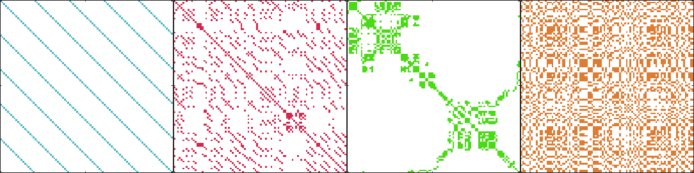

# Recurrence Analysis

Recurrence analysis of time series in MATLAB. Generates the distance matrix (DM) and the recurrence plot (RP). It also performs recurrence quantification analysis (RQA) and recurrence network analysis (RNA) of the recurrence matrix.

**Figure 1** _Recurrence plots of periodic, chaotic, auto-regressive, and sthocastic processes, respectively._

## References

1. J.P. Zbilut, C.L. Webber Jr., _Recurrence Quantification Analysis_, 2006. DOI: [doi.org/10.1002/9780471740360.ebs1355](doi.org/10.1002/9780471740360.ebs1355).
2. J.P. Zbilut, N. Thomasson, and C.L. Webber, "Recurrence quantification analysis as a tool for nonlinear exploration of nonstationary cardiac signals." Medical Engineering and Physics, n. 24, p. 53--60, 2002.
3. Recurrence Plots and Cross Recurrence Plots. URL: [www.recurrence-plot.tk](www.recurrence-plot.tk).

## License

MIT license (see LICENSE.txt for more details).
