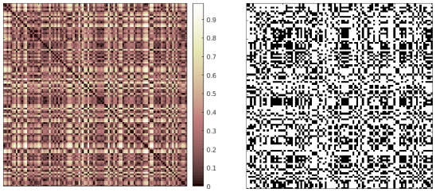
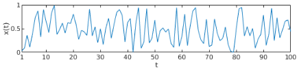
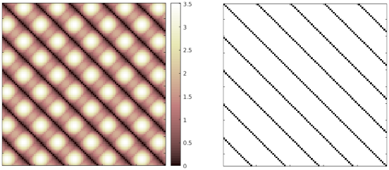
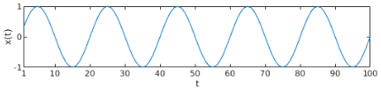

# Recurrence Analysis

The files in this repository can be used to perform recurrence analysis of time series in MATLAB. With them you can generate the distance matrix (DM) and the recurrence plot (RP). Soon, you will also be able to carry out recurrence quantification analysis (RQA) and recurrence network analysis (RNA).

-----------

## Content

1. Distance Matrix (DM)
2. Recurrence Plot (RP)
3. Recurrence Quantification Analysis (RQA)
4. Recurrence Network Analysis (RNA)
5. References
License

## 1. Distance Matrix (DM)

## 2. Recurrence Plot (RP)

Here are some examples of recurrence plots. See how beautiful and informative these binary matrices can be!

### Stochastic process

**Figure 1** _Recurrence plot of a sequence drawn from the uniform distribution_ x(t) \~ U(0,1)_. In this example, embedding dimension = 1 and threshold = 0.2._

### Sinusoidal function

**Figure 2** _Distance matrix and recurrence plot of a sinusoidal function given by_ x(t) = sin(2\*pi\*0.05\*t)_. In this example, the embedding dimension = 2, the time delay = 3, and the threshold = 0.2._

## 3. Recurrence Quantification Analysis (RQA)

## 4. Recurrence Network Analysis (RNA)

## 5. References

1. J.P. Zbilut, C.L. Webber Jr., _Recurrence Quantification Analysis_, 2006. DOI: <doi.org/10.1002/9780471740360.ebs1355>.
2. J.P. Zbilut, N. Thomasson, and C.L. Webber, "Recurrence quantification analysis as a tool for nonlinear exploration of nonstationary cardiac signals." Medical Engineering and Physics, n. 24, p. 53--60, 2002.
3. Recurrence Plots and Cross Recurrence Plots. Website: <www.recurrence-plot.tk>.

## License

MIT license (see LICENSE.txt for more details).
