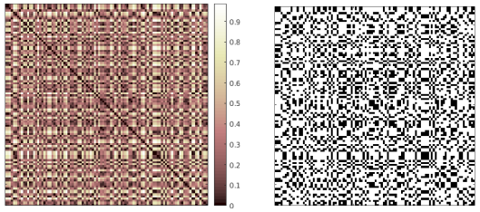

# Recurrence Analysis

The files in this repository can be used to perform recurrence analysis of time series in MATLAB. With them you can generate the distance matrix (DM) and the recurrence plot (RP). See Figure 1 below. Soon, you will also be able to carry out recurrence quantification analysis (RQA) and recurrence network analysis (RNA).

**Figure 1** _Distance matrix and recurrence plot of a sequence drawn from the uniform distribution_
